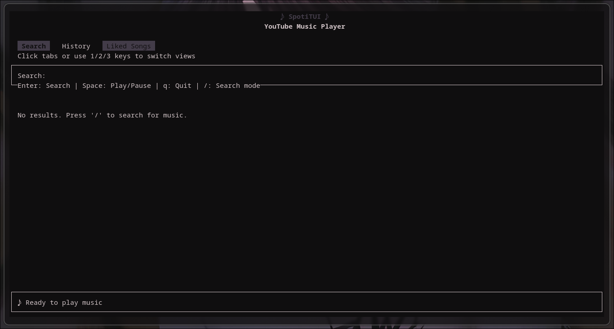
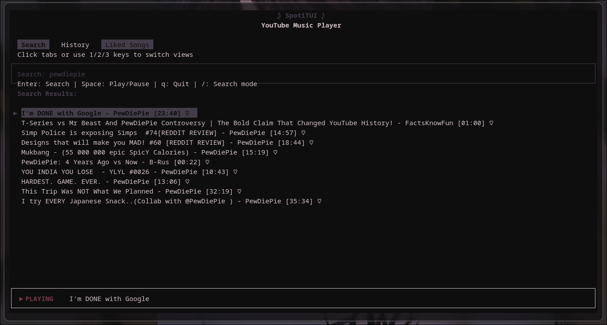
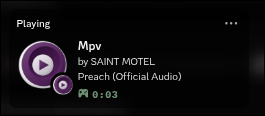
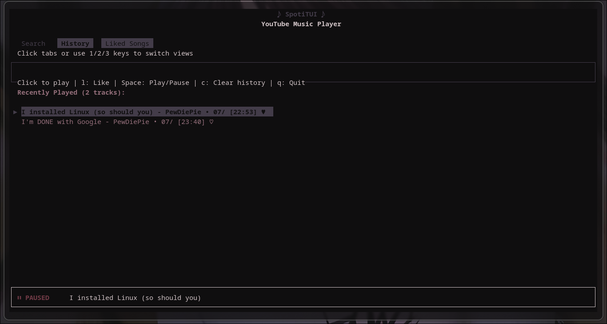
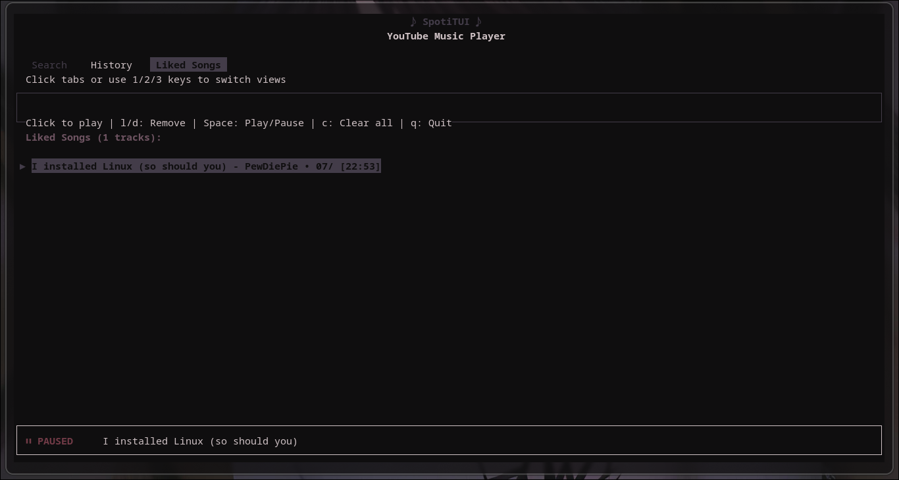

# Spoti/MpvTUI - Terminal YouTube Music Player
 A feature-rich terminal interface for Streaming YouTube music with MPV, featuring Discord Rich Presence integration, persistent favorites, and intuitive controls.

# 





# 




## History Feature



## Liked songs tab 



- [Installation](#installation)
- [Basic Usage](#basic-usage-without-discord-rpc)
- [Discord Integration](#discord-rich-presence-setup)
  - [Configuration](#configuration)
- [Controls](#controls)

## Installation

### Prerequisites
- Python 3.8+
- MPV player (`sudo apt/dnf/pacman/whatever-the-fuck-you-use install mpv`)
- yt-dlp (`pip install yt-dlp`)

```bash
git clone https://github.com/anshtable/mpv-tui.git
cd mpv-tui
pip install -r requirements.txt / pip install --upgrade -r requirements.txt
```

## Basic Usage (Without Discord RPC)
```bash
./mpv-tui.py
```

# Controls:

    1/2/3: Switch between Search/History/Liked tabs

    ↑/↓: Navigate tracks

    Enter: Play selected track

    Space: Play/Pause

    l: Like/Unlike track (or remove from Liked tab)

    d: Remove from Liked tab

    c: Clear current tab's contents

    /: Enter search mode

    q: Quit

# Discord Rich Presence Setup


Requirements:

   Discord desktop app running

    pypresence (pip install pypresence)


## In the mpv-tui.py file 
#### Here, instead of "path-to-discord-mpv.py" specify the path to the downloaded discord-mpv.py
```python
  # Start Discord RPC handler
            script_dir = os.path.dirname(os.path.abspath(__file__))
            discord_rpc_script = os.path.join(script_dir, 'path-to-discordmpv.py')
            self.rpc_process = subprocess.Popen(
                ['python3', discord_rpc_script, self.ipc_socket],
                stdout=subprocess.PIPE,
                stderr=subprocess.PIPE
            )
```

## Custom Image Setup:

  Create a Discord application at Discord Developer Portal

  
  Navigate to your application > Rich Presence > Art Assets

  Upload your image (minimum 512x512, recommended 1024x1024)

  Note your Application ID (needed for CLIENT_ID in code)

######  -------------- You might need to wait a few minutes for the Art Assets to actually take effect

#  Configuration:

  Open discord-mpv.py and replace the CLIENT_ID with your application ID:

  ```bash
  CLIENT_ID = "YOUR_APPLICATION_ID_HERE"  # Replace with your Discord app ID
```

The default image key is set to "mpv" - change this to match your uploaded image name:

```python
self.rpc.update(
    # ...
    large_image="mpv",  # Change this to your image key
    # ...
)
```


## Running with Discord Integration

```python
# Run normally (will auto-launch discordmpv.py when played a song)
./mpv-tui.py
```

## Enjoy your terminal music experience


#### made with ai btw
